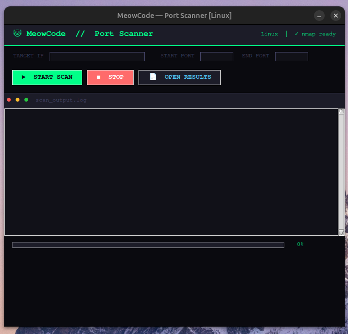

# Port Scanner

A cross-platform network port scanner built with Python, Tkinter and Nmap — featuring a dark terminal-style GUI, automatic OS detection, and auto dependency installation.

> Built and documented by [MeowCode](https://youtube.com/@MeowCode1808) on YouTube.

---

## 📸 Preview



---

## ✨ Features

- 🖥️ **Cross-platform** — works on Linux, Windows and macOS
- ⚙️ **Auto dependency installation** — detects your OS and installs nmap automatically
- 🎨 **Dark terminal UI** — color-coded output (green = open, red = error, dim = closed)
- 🧵 **Thread pool scanning** — fast concurrent scanning without crashing
- 📄 **Export results** — saves scan output to `scan_results.txt`
- 🔍 **Banner grabbing** — identifies services running on open ports via nmap

---

## 🖥️ Supported Platforms

| OS      | Auto-install nmap     | Tested |
|---------|-----------------------|--------|
| Linux   | ✅ via `apt`           | ✅     |
| macOS   | ✅ via `brew`          | ✅     |
| Windows | ✅ via `winget`        | ✅     |

---

## 🚀 Getting Started

### 1. Clone the repo

```bash
git clone https://github.com/DevMytho/port-scanner.git
cd port-scanner
```

### 2. Create a virtual environment (recommended)

```bash
python3 -m venv scanner-env
source scanner-env/bin/activate      # Linux / macOS
scanner-env\Scripts\activate         # Windows
```

### 3. Install Python dependencies

```bash
pip install python-nmap
```

### 4. Install tkinter (Linux only)

```bash
sudo apt install python3-tk
```

> macOS and Windows ship with tkinter by default.

### 5. Run the scanner

```bash
python3 scanner.py
```

> nmap will be auto-installed on first run if not already present.

---

## 🛠️ Usage

| Field       | Description                              |
|-------------|------------------------------------------|
| Target IP   | IP address to scan (e.g. `192.168.1.1`) |
| Start Port  | First port in range (default: `1`)       |
| End Port    | Last port in range (default: `1024`)     |

> 💡 Use `127.0.0.1` to scan your own machine for testing.

### Output colors

| Color  | Meaning              |
|--------|----------------------|
| 🟢 Green  | Port is open      |
| ⬛ Dim    | Port is closed    |
| 🔴 Red    | Error occurred    |
| 🔵 Blue   | Info / status     |
| 🟡 Yellow | Warning           |

---

## 📁 Project Structure

```
port-scanner/
├── scanner.py          # Main application
├── scan_results.txt    # Auto-generated scan output
└── README.md
```

---

## ⚙️ How It Works

```
User inputs IP + port range
        ↓
ThreadPoolExecutor spins up to 100 workers
        ↓
Each worker tries socket.connect_ex() on a port
        ↓
Open ports → nmap banner grab for service info
        ↓
Results posted to gui_queue (thread-safe)
        ↓
Main thread reads queue every 50ms via root.after()
        ↓
GUI updates with color-coded output
```

---

## 🔧 Requirements

- Python 3.8+
- `python-nmap` (pip)
- `tkinter` (system package on Linux)
- `nmap` binary (auto-installed on first run)

---

## ⚠️ Disclaimer

This tool is intended for **educational purposes and authorized network testing only**.
Do not scan networks or systems you do not own or have explicit permission to test.
The author takes no responsibility for misuse.

---

## 📺 Watch the Build

This project was built live on YouTube — cross-platform edition included.

**[▶ Watch on MeowCode](https://youtube.com/@MeowCode1808)**

---

## 📄 License

MIT License — free to use, modify and distribute.

---

<p align="center">Made with 🐱 by MeowCode</p># Port Scanner

## Prerequisites :-

```
Nmap
Python
Tkinter
```

This code assumes you are in linux environment where you can run sudo commands


#### Windows & Mac version under development
